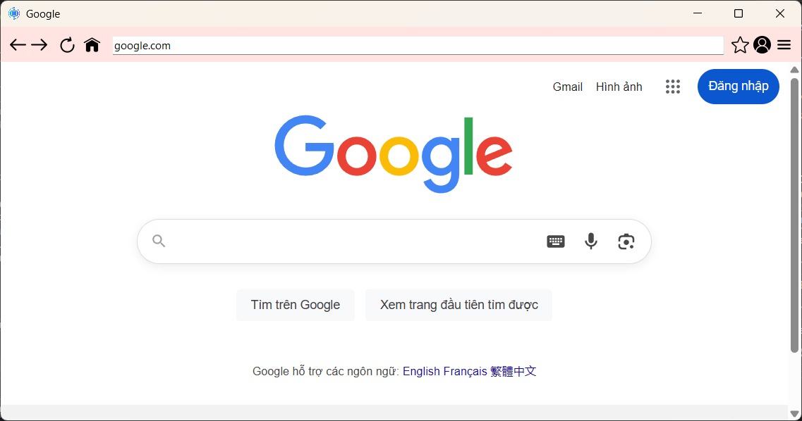
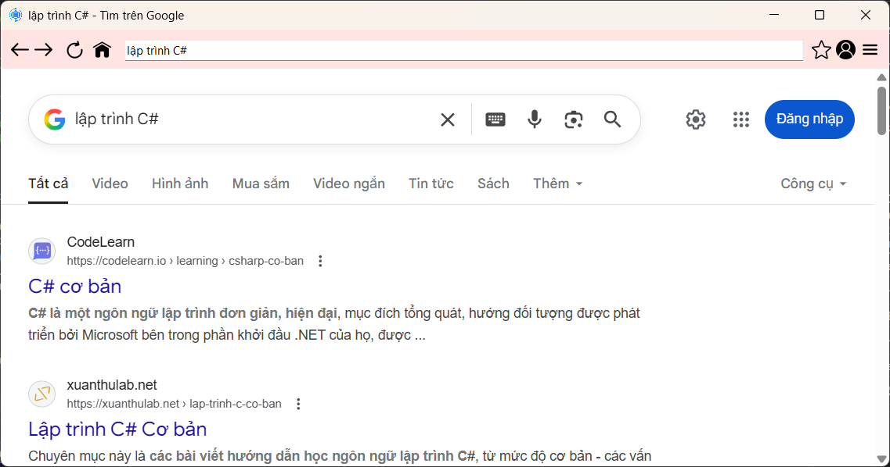
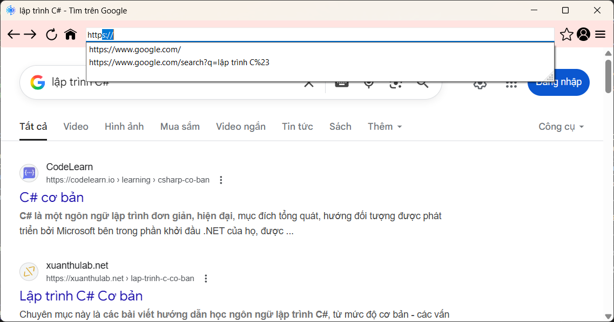

# ⚡ TrinhDuyet: Simple Web Browser using WinForms + WebView2 (Bài tập nhóm)

<div align="center">

[](https://github.com/trantienvn/TrinhDuyet/stargazers)
[](https://github.com/trantienvn/TrinhDuyet/network)
[](https://github.com/trantienvn/TrinhDuyet/issues)
[](LICENSE)
[](https://github.com/trantienvn/TrinhDuyet)

</div>

**TrinhDuyet** là một trình duyệt web cơ bản được xây dựng bằng **WinForms** và **WebView2**. Dự án mang tính giáo dục, phù hợp cho sinh viên học lập trình C# hoặc làm bài tập nhóm môn WinForms.

---

## 📑 Mục lục

- [📖 Giới thiệu](#-giới-thiệu)
- [✨ Tính năng](#-tính-năng-chính)
- [🖼️ Giao diện](#️-giao-diện)
- [🛠️ Công nghệ sử dụng](#-công-nghệ-sử-dụng)
- [🚀 Hướng dẫn chạy](#-hướng-dẫn-chạy)
- [📁 Cấu trúc dự án](#-cấu-trúc-dự-án)
- [🙏 Ghi nhận](#-ghi-nhận)
- [📞 Hỗ trợ](#-hỗ-trợ)
- [📌 Phân công công việc nhóm](#-phân-công-công-việc-nhóm)

---

## 📖 Giới thiệu

**TrinhDuyet** là một trình duyệt mini hỗ trợ:
- Điều hướng web (Back, Forward, Home, Refresh)
- Giao diện đơn giản, dễ sử dụng
- Chức năng đăng nhập cơ bản
- Quản lý lịch sử truy cập và bookmark

Ứng dụng được phát triển nhằm mục tiêu học tập, làm bài tập nhóm về WinForms.

---

## ✨ Tính năng chính

- 🌐 **Hiển thị trang web:** Thông qua `WebView2`
- 📍 **Thanh điều hướng:** URL + các nút Back, Forward, Refresh, Home  
  → *(`MainWebForm.cs`)*
- 🔐 **Đăng nhập:** Giao diện và xử lý đăng nhập cơ bản  
  → *(`DangNhap.cs`)*
- 👤 **Lưu thông tin người dùng:**  
  → *(`UserStore.cs`)*
- 🕘 **Lịch sử truy cập & Bookmark:**  
  → *(`LichSu.cs`, `Bookmark.cs`) nếu có*

---

## 🖼️ Giao diện

### 🌐 Trang chủ (Google)


### 🔎 Tìm kiếm với Google


### 📑 Gợi ý URL khi nhập


---

## 🛠️ Công nghệ sử dụng

| Thành phần | Mô tả |
|------------|-------|
| 💻 Ngôn ngữ | C# |
| 🏗️ Framework | .NET Framework *(version cần bổ sung)* |
| 🎨 UI | WinForms |
| 🌍 Web Engine | WebView2 |

---

## 🚀 Hướng dẫn chạy

### 🔧 Yêu cầu

- Visual Studio (>=2019)
- WebView2 Runtime (bắt buộc)
- .NET Framework (Xem trong `TrinhDuyet.csproj`)

### 💡 Cách chạy

```bash
git clone https://github.com/trantienvn/TrinhDuyet.git
````

1. Mở file `TrinhDuyet.sln` bằng Visual Studio
2. Build project (`Ctrl + Shift + B`)
3. Run (`F5`)

---

## 📁 Cấu trúc dự án

```plaintext
TrinhDuyet/
├── DangNhap.cs             // Form đăng nhập
├── MainWebForm.cs          // Form chính của trình duyệt
├── MainWebFormTest.cs      // File test MainWebForm
├── UserInfo.cs             // Hiển thị thông tin người dùng
├── UserStore.cs            // Lưu dữ liệu người dùng
├── Program.cs              // Điểm vào ứng dụng
├── Resources/              // Tài nguyên
├── Properties/             // Cấu hình project
├── TrinhDuyet.csproj       // File cấu hình project
├── TrinhDuyet.sln          // File solution
├── LICENSE
└── README.md
```

---

## 🙏 Ghi nhận

> Dự án được tham khảo từ ChatGPT, Gemini và Microsoft WebView2.

---

## 📞 Hỗ trợ

* Báo lỗi: [GitHub Issues](https://github.com/trantienvn/TrinhDuyet/issues)
* Góp ý, hỗ trợ: Vui lòng tạo Issue hoặc PR

---

## 📌 Phân Công Công Việc Nhóm

| Thành viên         | Nhiệm vụ                                                             |
| ------------------ | -------------------------------------------------------------------- |
| **Trần Văn Tiến**  | Điều hướng web, xử lý WebView2, các chức năng duyệt cơ bản           |
| **Lý Văn Quyến**   | Thiết kế giao diện, layout, icon, trải nghiệm người dùng             |
| **Đặng Xuân Thảo** | Lưu lịch sử, quản lý bookmark, giao diện hiển thị danh sách truy cập |

### Quy trình làm việc

* Mỗi thành viên làm riêng (file hoặc branch)
* Merge vào nhánh chính sau khi hoàn thiện
* Test & sửa lỗi chung
